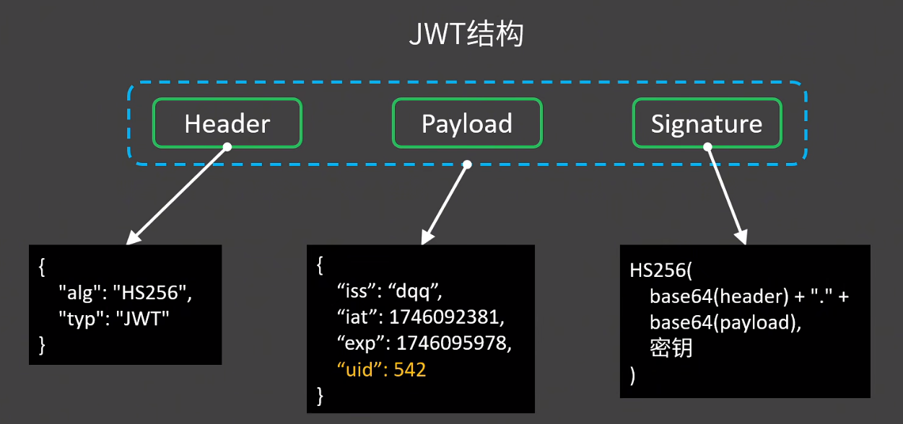
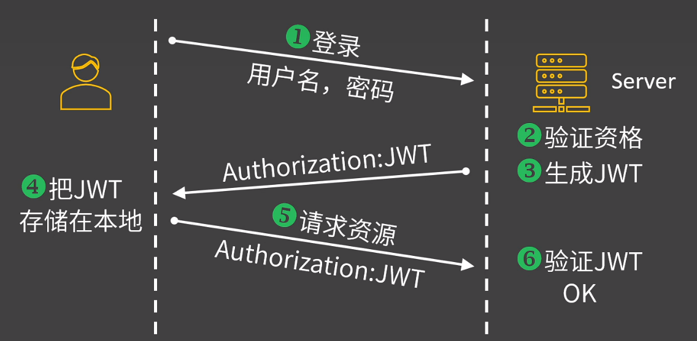

# JWT身份认证

在前后端分离的项目中，使用 **JWT（JSON Web Token）** 进行身份认证是一种常见的方案。

JWT结构：



JWT流程：




以Django为例， **`djangorestframework-simplejwt`** 是 Django REST Framework (DRF) 中一个流行的 JWT 实现库。以下是 **JWT 认证的完整流程及前后端协作方式**：

---

## **1. 后端配置（Django + DRF + SimpleJWT）**
### **(1) 安装依赖**
```bash
pip install djangorestframework-simplejwt
```

### **(2) 配置 `settings.py`**
```python
# settings.py

INSTALLED_APPS = [
    ...
    'rest_framework',
    'rest_framework_simplejwt',  # 添加 SimpleJWT
]

REST_FRAMEWORK = {
    'DEFAULT_AUTHENTICATION_CLASSES': [
        'rest_framework_simplejwt.authentication.JWTAuthentication',  # 使用 JWT 认证
    ],
}

# JWT 配置（可选，调整 token 有效期等）
from datetime import timedelta
SIMPLE_JWT = {
    'ACCESS_TOKEN_LIFETIME': timedelta(minutes=30),  # Access Token 有效期
    'REFRESH_TOKEN_LIFETIME': timedelta(days=1),     # Refresh Token 有效期
}
```

### **(3) 添加 JWT 路由**
```python
# urls.py
from rest_framework_simplejwt.views import (
    TokenObtainPairView,
    TokenRefreshView,
)

urlpatterns = [
    ...
    path('api/token/', TokenObtainPairView.as_view(), name='token_obtain_pair'),  # 获取 Token
    path('api/token/refresh/', TokenRefreshView.as_view(), name='token_refresh'), # 刷新 Token
]
```

### **(4) 测试 JWT 接口**
- **获取 Token**（登录）：
  ```bash
  POST /api/token/
  Body: {"username": "admin", "password": "admin123"}
  Response:
  {
      "access": "eyJhbGciOiJIUz...",  # Access Token
      "refresh": "eyJhbGciOiJIUz..."  # Refresh Token
  }
  ```
- **刷新 Token**：
  ```bash
  POST /api/token/refresh/
  Body: {"refresh": "eyJhbGciOiJIUz..."}
  Response:
  {
      "access": "eyJhbGciOiJIUz..."  # 新的 Access Token
  }
  ```

---

## **2. 前端集成（JavaScript + Axios）**
### **(1) 登录并存储 Token**
```javascript
// 示例：Vue.js + Axios 登录
import axios from 'axios';

const login = async (username, password) => {
    try {
        const response = await axios.post('http://localhost:8000/api/token/', {
            username,
            password,
        });
        const { access, refresh } = response.data;
        
        // 存储 Token（localStorage 或 Vuex/Pinia）
        localStorage.setItem('access_token', access);
        localStorage.setItem('refresh_token', refresh);
        
        return true;
    } catch (error) {
        console.error('登录失败:', error);
        return false;
    }
};
```

### **(2) 发送请求时携带 Token**
```javascript
// 封装 Axios 请求，自动添加 Authorization 头
axios.interceptors.request.use((config) => {	// 每次请求发送前，该函数会被调用
    const token = localStorage.getItem('access_token');
    if (token) {
        config.headers.Authorization = `Bearer ${token}`;
    }
    return config;
});

// 调用受保护的 API
const fetchBlogs = async () => {
    try {
        const response = await axios.get('http://localhost:8000/api/blogs/');
        return response.data;
    } catch (error) {
        if (error.response.status === 401) {
            // Token 过期，尝试刷新
            await refreshToken();
            return fetchBlogs(); // 重试请求
        }
        throw error;
    }
};
```

### **(3) 处理 Token 过期（自动刷新）**
```javascript
const refreshToken = async () => {
    const refresh = localStorage.getItem('refresh_token');
    if (!refresh) throw new Error('无有效 Refresh Token');
    
    try {
        const response = await axios.post('http://localhost:8000/api/token/refresh/', {
            refresh,
        });
        localStorage.setItem('access_token', response.data.access);
    } catch (error) {
        // Refresh Token 失效，强制退出登录
        localStorage.removeItem('access_token');
        localStorage.removeItem('refresh_token');
        window.location.href = '/login';
    }
};
```

---

## 3.后端校验


1. **客户端请求**：在请求头中携带 `Authorization: Bearer <access_token>`。
2. **DRF 自动校验**：
   - `JWTAuthentication` 中间件解析 Token，验证签名、有效期。
   - 校验成功：将 `request.user` 设置为对应的用户实例。
   - 校验失败：返回 `401 Unauthorized`。
3. **权限控制**：通过 `permission_classes` 进一步限制访问。

---

### **(1) 视图层校验（自动）**
DRF 的 `JWTAuthentication` 会自动处理 Token 校验，只需在视图或全局配置中启用即可：

```python
# views.py
from rest_framework.views import APIView
from rest_framework.response import Response
from rest_framework.permissions import IsAuthenticated

class ProtectedView(APIView):
    # 启用 JWT 认证 + 登录权限校验
    authentication_classes = [JWTAuthentication]  # 可全局配置，此处可省略
    permission_classes = [IsAuthenticated]       # 必须登录

    def get(self, request):
        return Response({"message": f"Hello, {request.user.username}!"})
```

### **(2) 全局配置**
在 `settings.py` 中全局启用 JWT 认证，避免重复定义：
```python
# settings.py
REST_FRAMEWORK = {
    'DEFAULT_AUTHENTICATION_CLASSES': [
        'rest_framework_simplejwt.authentication.JWTAuthentication',
    ],
    'DEFAULT_PERMISSION_CLASSES': [
        'rest_framework.permissions.IsAuthenticated',  # 默认所有接口需登录
    ],
}
```

### **(3) 自定义权限校验**
如果需要更复杂的权限（如仅允许作者修改博客）：
```python
# permissions.py
from rest_framework.permissions import BasePermission

class IsBlogAuthor(BasePermission):
    def has_object_permission(self, request, view, obj):
        # 仅允许作者操作
        return obj.author == request.user

# 在视图中使用
class BlogDetailView(APIView):
    permission_classes = [IsAuthenticated, IsBlogAuthor]  # 组合权限
```


## **3. 安全注意事项**

1. **不要长期存储 Access Token**  
   
   - 设置较短的有效期（如 30 分钟），依赖 Refresh Token 续期。
2. **避免 XSS 攻击**  
   
   - 不要将 Token 存储在 `document.cookie` 中（除非设置 `HttpOnly` + `Secure`）。
3. **HTTPS 必选**  
   
   - JWT 在明文传输中可能被截获，务必使用 HTTPS。

---

## **总结**
- **流程**：  
  用户登录 → 后端返回 `access` + `refresh` → 前端存储并附加到请求头 → 后端校验 Token → 返回数据。
- **关键代码**：
  - 后端：`JWTAuthentication` + `TokenObtainPairView`。
  - 前端：`axios.interceptors` + `Bearer ${token}`。
- **优化**：  
  可结合 `Redis` 存储 Token 黑名单，实现即时失效（如用户退出登录）。
